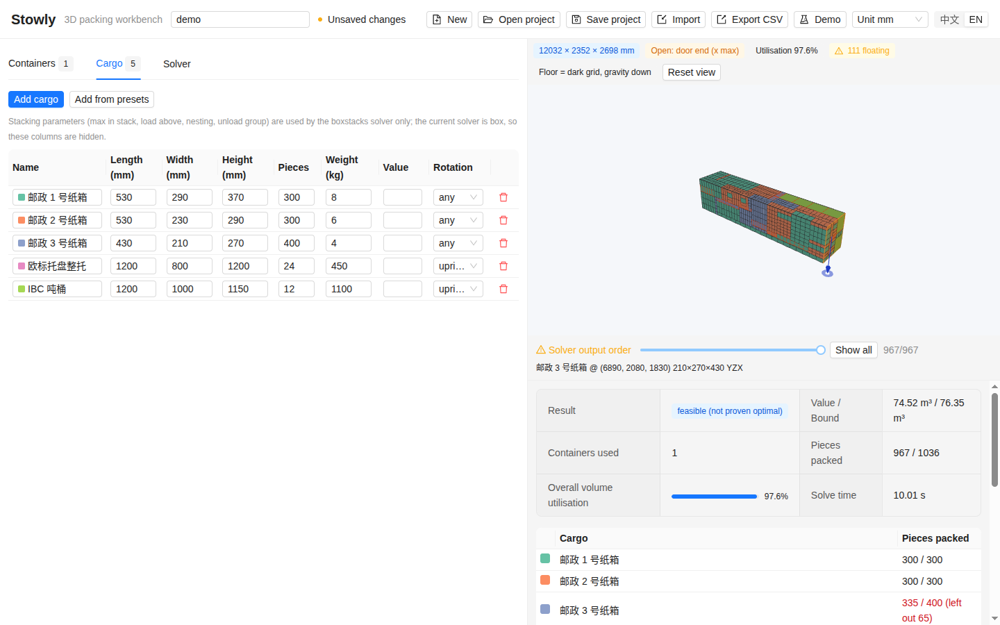

# Stowly

**English** | [中文说明](README_zh.md)

[](https://github.com/HansBug/stowly/actions/workflows/test.yaml)
[](https://github.com/HansBug/stowly/actions/workflows/build.yaml)
[](https://codecov.io/gh/HansBug/stowly)
[](LICENSE)

Stowly is a desktop workbench for three-dimensional load planning: describe the containers (ISO boxes, trucks, pallets, cartons) and the cargo, press *Solve*, and get a placement for every piece with a 3D view, utilisation figures and a CSV you can hand to the warehouse. The solver is [packingsolver3d](https://github.com/HansBug/packingsolver3d), an in-process Python binding of Florian Fontan's [PackingSolver](https://github.com/fontanf/packingsolver) `box` and `boxstacks` algorithms; Stowly wraps it in an Electron shell with a React / Ant Design interface and a Three.js viewer. Everything runs locally and offline; the installers carry their own Python.



## What it does

- **Containers and cargo tables** with lengths in mm, cm, m or inches, per-type quantities, weights, values and rotation rules (any / upright / fixed).
- **Built-in presets with sources**: ISO 20'/40'/40' HQ/45' HQ and reefers, Chinese 4.2–17.5 m trucks, European and US trailers, EUR/GMA/Asian pallets, China Post standard cartons, VDA KLT and Euro totes, IBC tanks, Gaylord boxes, US moving boxes. Every entry cites where its dimensions come from ([`backend/stowly_backend/presets/SOURCES.md`](backend/stowly_backend/presets/SOURCES.md)).
- **Three objectives**: pack everything into as few containers as possible, fill one container with the most valuable subset (knapsack, value defaults to volume), or choose the cheapest mix of container sizes. `box` for plain packing, `boxstacks` when stacking, weight limits or truck axle rules matter.
- **Honest results**: the status distinguishes a *proven optimal* packing from a *feasible* one whose bound was not closed, and the value / bound pair is always shown.
- **3D viewer** with hover and click inspection, a loading-order slider, and one scene per container.
- **Files**: Stowly project JSON (`stowly/1`), CSV / XLSX cargo lists with Chinese or English headers, ESICUP `thpack` / BR text instances, PackingSolver `items.csv` + `bins.csv` pairs; placement export as CSV.
- **Chinese by default, English one click away.** Every label exists in both languages.

## Install

Download the package for your platform from the [Releases](https://github.com/HansBug/stowly/releases) page (every build is also attached to the [Build Desktop](https://github.com/HansBug/stowly/actions/workflows/build.yaml) workflow runs as an artifact).

Every platform comes in two forms per architecture. The **portable** archive is extract-and-run: unpack it anywhere (a USB stick, a shared drive) and start `Stowly`; nothing is written outside your user profile. The **installer** integrates with the system (menu entry, uninstaller). File names spell it out: `Stowly-<version>-<os>-<arch>-portable.<ext>` and `Stowly-<version>-<os>-<arch>-installer.<ext>`.

| Platform | Portable (extract and run) | Installer | Notes |
|---|---|---|---|
| Linux x64 / arm64, glibc ≥ 2.31 (Ubuntu 20.04+, Debian 11+, RHEL 9+) | `…-linux-<arch>-portable.tar.gz` → `./stowly` | `…-linux-<arch>-installer.deb` (installs to `/opt/Stowly`), or the single-file `…-linux-<arch>.AppImage` | On distributions that restrict unprivileged user namespaces (Ubuntu 24.04+) the portable build and the AppImage need `--no-sandbox`; the `.deb` sets the sandbox helper's permissions. |
| Windows 10 / 11, x64 / arm64 | `…-win-<arch>-portable.zip` → `Stowly.exe` | `…-win-<arch>-installer.exe` (NSIS, per-user, choose the folder) | Unsigned: SmartScreen shows "unknown publisher" the first time. |
| macOS 12+, Apple Silicon (arm64) / Intel (x64) | `…-mac-<arch>-portable.zip` → `Stowly.app` | `…-mac-<arch>-installer.dmg` | Unsigned: open with right-click → *Open*, or run `xattr -dr com.apple.quarantine Stowly.app` once. |

Each package bundles a relocatable CPython 3.12 with the backend and `packingsolver3d` for its own architecture; nothing else needs to be installed. Before a package is published, the Build Desktop workflow runs the app's self-test on it in an environment without Python or Node: the Linux packages inside bare `ubuntu:20.04` / `ubuntu:22.04` containers, the Windows and macOS packages with the runners' toolchains hidden from `PATH`.

## Quick start

1. Start Stowly and press **Demo** in the toolbar: a 40' HQ container with three sizes of postal cartons, loaded EUR pallets and IBC tanks, more cargo than fits.
2. Look at the **Containers** and **Cargo** tabs; edit any cell, or add rows by hand or **From presets**.
3. Open **Solver**: `box`, objective *Knapsack: highest value*, 10 seconds. The line under the settings compares total cargo volume with container capacity.
4. Press **Solve**. The 3D view fills up; the result panel reports the status (`feasible (not proven optimal)` for the demo), value / bound, containers used, pieces packed and utilisation, followed by a per-cargo count of what was left out and the placement list.
5. **Export CSV** writes one row per placed piece (container, item, position, placed size, rotation). **Save project** keeps the whole setup as JSON for next time.

Switch the length unit (mm / cm / m / in) in the toolbar at any moment; values convert, the solver always receives millimetres. Switch the language with the 中文 / EN toggle.

## Files

| Import | Recognised by | Notes |
|---|---|---|
| Stowly project | `.json` with `"schema": "stowly/1"` | Full round trip of containers, cargo and settings. |
| Cargo list | `.csv` / `.xlsx` with a header row | Columns are matched by name in Chinese or English: name / 名称, length / 长, width / 宽, height / 高, quantity / 数量, weight / 重量, value / 价值, rotation / 旋转. Units in the header such as `Length (mm)` are ignored; the unit is chosen in the import dialog. Appended to the current cargo. |
| ESICUP `thpack` / BR | `.txt` / `.dat` / `.thpack` | Bischoff–Ratcliff container-loading instances; pick the instance index in the dialog. Replaces the project. |
| PackingSolver | `items.csv` + `bins.csv` selected together, or a single `items.csv` | The CSV layout of the upstream solver, including `ROTATION_*` flags. |

Export writes placements as CSV: `bin, bin_name, bin_copies, item, item_name, x, y, z, lx, ly, lz, rotation`, all lengths in millimetres, positions being the lower corner in the container's coordinate system (x along the length, y across, z up).

## How it works

```text
Electron main process ──spawn──▶ python -m stowly_backend --port 0 --token …   (bundled CPython)
        │  READY {"host","port"}  ◀──────────────┘
        │
        └─ BrowserWindow (React + Ant Design + Three.js)  ──HTTP + X-Stowly-Token──▶  FastAPI on 127.0.0.1
                                                                                          └─ packingsolver3d (box / boxstacks)
```

The main process starts the backend, waits for its `READY` line and hands the port and a random token to the renderer. The renderer talks plain HTTP to the backend (presets, import, solve jobs, export); the token keeps other local programs out. Solves run in a worker thread and are polled, so the interface stays responsive. The project model stores millimetres and kilograms; the interface converts for display. Statuses come from packingsolver3d unchanged: `optimal` only when the achieved value meets the reported bound.

## Development

`make help` lists every target. The first `make run` creates `.venv` with the backend and runs `npm ci` by itself.

```shell
make run            # Electron with hot reload; the backend runs from .venv (or STOWLY_PYTHON)
make test           # backend pytest with coverage, frontend vitest with coverage, typecheck
make probe          # build, then drive the app with Playwright: screenshots and console errors under /tmp/stowly_ui
make build          # renderer/main/preload bundles into out/
```

Requirements: Node 20 or 22, Python 3.10 or newer, GNU make. Without make: `python -m venv .venv && .venv/bin/pip install -e "./backend[test]"`, then `npm ci`, `npm run typecheck`, `npm run test:coverage`, `npm run dev`; backend tests are `cd backend && pytest --cov`.

On Linux, `make run` restores a missing Electron binary, picks the desktop's `DISPLAY` when the shell has none, and passes `--noSandbox` on hosts that restrict unprivileged user namespaces.

## Packaging

```shell
make dist-dir       # relocatable CPython 3.12 + backend + packingsolver3d into resources/python, then dist/<platform>-unpacked
make dist           # same, plus the installers: AppImage/deb, NSIS installer, DMG
make smoke          # dist-dir, then the packaged app's self-test (stowly --smoke) with a JSON report
```

`stowly --smoke[=report.json]` is built into the app: it starts the bundled interpreter, calls the HTTP API, runs a small solve, checks that the renderer loaded and reached the backend, writes a report and exits 0 or 1. The Build Desktop workflow builds six targets natively (Linux, Windows and macOS on x64 and arm64 runners), runs the self-test on every portable archive and every installer (Linux inside bare `ubuntu:20.04` and `ubuntu:22.04` containers, Windows and macOS with the runners' toolchains hidden from `PATH`), uploads packages and reports as artifacts, and turns a `v*` tag into a GitHub release.

## Compatibility

| Component | Supported | Why |
|---|---|---|
| Linux | x64 and arm64, glibc ≥ 2.31 (Ubuntu 20.04+, Debian 11+, RHEL 9+) | Electron 44 requires glibc 2.31; the bundled CPython needs only 2.17. Verified by the `ubuntu:20.04` / `ubuntu:22.04` container tests on both architectures. |
| Windows | 10 / 11, x64 and arm64 | Electron 44 dropped Windows 7–8.1; the arm64 build is native (no emulation), built and self-tested on a Windows 11 arm64 runner. |
| macOS | 12 Monterey or newer, arm64 and x64 | Electron 44 and python-build-standalone 3.12 floors. |
| Development | Node 20 / 22, Python 3.10 / 3.12 | The Code Test workflow runs both sides on Linux, Windows and macOS with coverage. |

## License and credits

MIT, see [LICENSE](LICENSE). Stowly is an independent project built on [packingsolver3d](https://github.com/HansBug/packingsolver3d) and, through it, on [PackingSolver](https://github.com/fontanf/packingsolver) by Florian Fontan (MIT). Preset dimensions are typical public values and are cited in [`SOURCES.md`](backend/stowly_backend/presets/SOURCES.md); always check the plate of the actual equipment.
