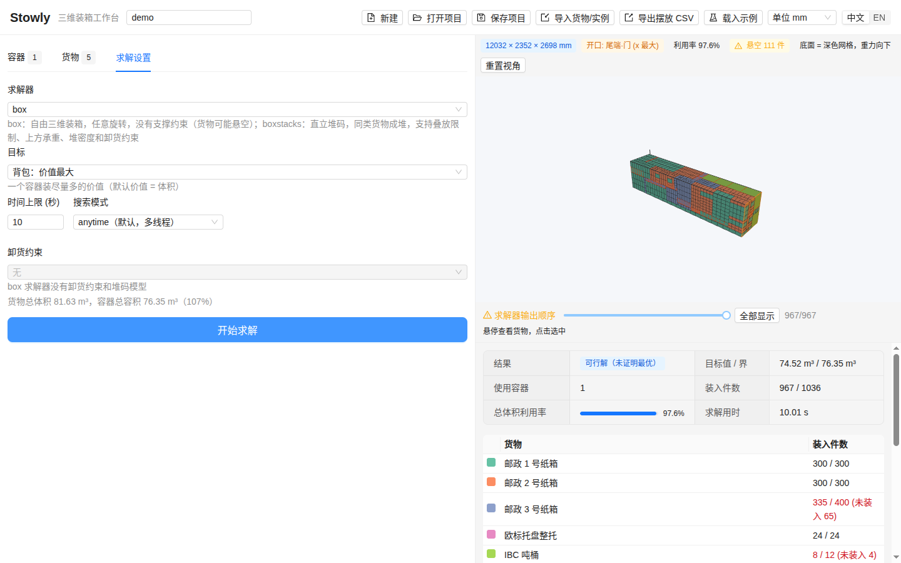

# Stowly

[English](README.md) | **中文说明**

[](https://github.com/HansBug/stowly/actions/workflows/test.yaml)
[](https://github.com/HansBug/stowly/actions/workflows/build.yaml)
[](https://codecov.io/gh/HansBug/stowly)
[](LICENSE)

Stowly 是一个三维装载规划桌面工具：填好容器（集装箱、货车、托盘、纸箱）和货物，点"开始求解"，就能得到每一件货物的摆放位置、三维视图、利用率数字，以及一份可以直接交给仓库的 CSV。求解器是 [packingsolver3d](https://github.com/HansBug/packingsolver3d)，即 Florian Fontan 的 [PackingSolver](https://github.com/fontanf/packingsolver) 中 `box` / `boxstacks` 两个算法的进程内 Python 绑定；Stowly 用 Electron 外壳、React / Ant Design 界面和 Three.js 视图把它包起来。全部在本机离线运行，安装包自带 Python。



## 能做什么

- **容器与货物表格**：长度单位可选 mm / cm / m / in，每种货物有件数、重量、价值和旋转规则（任意 / 直立 / 固定）。
- **带来源的内置预设**：ISO 20 尺 / 40 尺 / 40 尺高柜 / 45 尺高柜及冷藏箱、国内 4.2–17.5 米货车、欧美挂车、EUR / GMA / 亚洲托盘、邮政标准纸箱、VDA KLT 与欧标周转箱、IBC 吨桶、Gaylord 大箱、美式搬家箱。每一条都注明尺寸出处（[`backend/stowly_backend/presets/SOURCES.md`](backend/stowly_backend/presets/SOURCES.md)）。
- **三种目标**：全部装下且容器最少；一个容器装尽量多的价值（背包，价值默认为体积）；按成本挑选容器组合。
- **两个物理假设不同的求解器。** `box` 是自由三维装箱：任意旋转、没有支撑约束，所以解里可能有悬空货物，输出顺序也只是搜索顺序而非装载顺序——视图里会明确标注并统计悬空件数。`boxstacks` 只直立摆放（"任意"旋转按直立处理），把同种货物叠成立在地面上的堆，输出逐堆自下而上，可以直接当作装载顺序。
- **`boxstacks` 的堆码规则**：每堆最多件数、单件上方最大承重、嵌入深度、卸货分组 + 卸货约束（卸货口在 x 最大端或 y 最大端，0 组最先卸），以及容器的地面堆密度上限。这些列只在选中 `boxstacks` 时出现；`box` 没有堆码模型，界面会直接说明，而不是悄悄忽略你填的值。
- **容器的开口面**：门和敞口顶是容器定义的一部分（预设自带：集装箱与货车门在尾端，托盘四面敞开），三维视图里用琥珀色标出；底面是带重力箭头的深色网格板，悬空货物用红色描边，从任何视角都能看清装卸方向和谁压在谁上面。
- **诚实的结果**：状态区分"已证明最优"与"可行解（未证明最优）"，目标值与界始终并列显示。
- **三维视图**：悬停 / 点击查看货物，装载顺序滑块，每个容器一个场景。
- **文件**：Stowly 项目 JSON（`stowly/1`）、中英文列名的 CSV / XLSX 货物清单、ESICUP `thpack` / BR 文本实例、PackingSolver 的 `items.csv` + `bins.csv`；摆放结果导出为 CSV。
- **默认中文，一键切英文**，所有文案两种语言齐全。

## 安装

在 [Releases](https://github.com/HansBug/stowly/releases) 页面下载对应平台的安装包（每次 [Build Desktop](https://github.com/HansBug/stowly/actions/workflows/build.yaml) 工作流的构建产物也都作为 artifact 附在运行记录里）。

每个平台、每种架构都提供两种形态。**portable（绿色版）**解压即用：解到任意位置（U 盘、共享盘都行）直接运行 `Stowly`，除用户目录外不写任何东西。**installer（安装版）**与系统集成（菜单项、卸载程序）。文件名直接写明：`Stowly-<版本>-<os>-<arch>-portable.<ext>` 与 `Stowly-<版本>-<os>-<arch>-installer.<ext>`。

| 平台 | 绿色版（解压即用） | 安装版 | 说明 |
|---|---|---|---|
| Linux x64 / arm64，glibc ≥ 2.31（Ubuntu 20.04+、Debian 11+、RHEL 9+） | `…-linux-<arch>-portable.tar.gz` → `./stowly` | `…-linux-<arch>-installer.deb`（装到 `/opt/Stowly`），或单文件 `…-linux-<arch>.AppImage` | 在限制非特权 user namespace 的发行版（Ubuntu 24.04 及以后）上，绿色版与 AppImage 需要加 `--no-sandbox`；`.deb` 会设置好沙箱辅助程序权限。 |
| Windows 10 / 11，x64 / arm64 | `…-win-<arch>-portable.zip` → `Stowly.exe` | `…-win-<arch>-installer.exe`（按用户安装，可选目录；x64 为 NSIS，arm64 为 Inno Setup） | 未签名：首次运行 SmartScreen 会提示"未知发布者"。 |
| macOS 12+，Apple Silicon（arm64）/ Intel（x64） | `…-mac-<arch>-portable.zip` → `Stowly.app` | `…-mac-<arch>-installer.dmg` | 未签名：右键 → 打开，或执行一次 `xattr -dr com.apple.quarantine Stowly.app`。 |

每个包都内置与自身架构匹配的可迁移 CPython 3.12、后端和 `packingsolver3d`，不需要再安装任何东西。发布前，Build Desktop 工作流会在没有 Python 和 Node 的环境里对每个包跑应用自检：Linux 包在干净的 `ubuntu:20.04` / `ubuntu:22.04` 容器里，Windows 与 macOS 包则把 runner 自带工具链从 `PATH` 里藏掉。

## 快速上手

1. 启动 Stowly，点工具栏的**载入示例**：一个 40 尺高柜，三种邮政纸箱、整托欧标托盘和 IBC 吨桶，货比空间多。
2. 看**容器**和**货物**两个页签；任何单元格都可以直接改，也可以手动添加行或**从预设添加**。
3. 打开**求解设置**：`box`，目标"背包：价值最大"，10 秒。设置下方那行把货物总体积和容器总容积做了对比。
4. 点**开始求解**。三维视图填满，结果面板给出状态（示例是"可行解（未证明最优）"）、目标值 / 界、使用容器数、装入件数和利用率，接着是每种货物的装入 / 未装入统计和摆放明细。`box` 下视图上方的滑块标为"求解器输出顺序"并带警示提示，琥珀色标签统计悬空件数；要得到可执行的装载顺序请切到 `boxstacks`。
5. **导出摆放 CSV** 写出每件货物一行（容器、货物、位置、摆放后尺寸、旋转）。**保存项目**把整套设置存成 JSON，下次直接打开。

工具栏随时可以切换长度单位（mm / cm / m / in），数值自动换算，求解器收到的永远是毫米。语言用 中文 / EN 开关切换。

## 文件格式

| 导入 | 识别方式 | 说明 |
|---|---|---|
| Stowly 项目 | 含 `"schema": "stowly/1"` 的 `.json` | 容器、货物、设置完整往返。 |
| 货物清单 | 带表头的 `.csv` / `.xlsx` | 按列名中英文匹配：名称 / name、长 / length、宽 / width、高 / height、数量 / quantity、重量 / weight、价值 / value、旋转 / rotation。表头里的单位（如 `Length (mm)`）会被忽略，单位在导入对话框里选。追加到当前货物之后。 |
| ESICUP `thpack` / BR | `.txt` / `.dat` / `.thpack` | Bischoff–Ratcliff 集装箱装载实例；在对话框里选实例序号。会替换整个项目。 |
| PackingSolver | 同时选中 `items.csv` + `bins.csv`，或单个 `items.csv` | 上游求解器的 CSV 格式，含 `ROTATION_*` 标志。 |

导出的摆放 CSV 列为 `bin, bin_name, bin_copies, item, item_name, x, y, z, lx, ly, lz, rotation`，长度全部为毫米，位置是货物在容器坐标系中的下角点（x 沿长度方向，y 沿宽度，z 向上）。

## 工作原理

```text
Electron 主进程 ──spawn──▶ python -m stowly_backend --port 0 --token …   （内置 CPython）
        │  READY {"host","port"}  ◀──────────────┘
        │
        └─ BrowserWindow（React + Ant Design + Three.js）──HTTP + X-Stowly-Token──▶  127.0.0.1 上的 FastAPI
                                                                                          └─ packingsolver3d（box / boxstacks）
```

提供两个求解器是因为它们建模的东西不同。`box`（上游 `packingsolver::box`）是纯几何装箱：六种旋转都允许，没有任何"必须压在别的货上"的要求，所以结果可能悬空，摆放顺序就是树搜索插入货物的顺序。`boxstacks`（上游 `packingsolver::boxstacks`）把同种货物叠成直立的堆立在地面上，支持叠放上限、上方承重、堆密度、轴荷和卸货约束；Stowly 在这里把"任意"旋转映射为直立（上游只摆 XYZ/YXZ，算法遇到侧躺旋转会失效）、给每种货物独立的堆 id，并转发堆码列。`boxstacks` 在"全部装下"（装箱目标）和单一货物背包上既密又稳；混合货物且装不下时，上游的顺序启发式可能在时限内一无所获——这是上游算法的限制，Stowly 会报"没有找到解"。

主进程启动后端，等它打印 `READY` 行，再把端口和一个随机令牌交给渲染进程。渲染进程通过普通 HTTP 调用后端（预设、导入、求解任务、导出）；令牌用来挡住本机其他程序。求解在工作线程里进行、前端轮询，界面不会卡住。项目模型内部统一存毫米和千克，界面负责换算。状态原样来自 packingsolver3d：只有达到的值等于报告的界时才是 `optimal`。

## 开发

`make help` 列出全部目标。第一次 `make run` 会自动创建 `.venv` 并安装后端、执行 `npm ci`。

```shell
make run            # Electron 热更新；后端来自 .venv（或 STOWLY_PYTHON）
make test           # 后端 pytest 覆盖率 + 前端 vitest 覆盖率 + typecheck
make probe          # 构建后用 Playwright 驾驭应用走一遍流程，截图和 console 报错在 /tmp/stowly_ui
make build          # 把 renderer / main / preload 打成 out/
```

依赖：Node 20 或 22，Python 3.10 及以上，GNU make。不用 make 的话：`python -m venv .venv && .venv/bin/pip install -e "./backend[test]"`，然后 `npm ci`、`npm run typecheck`、`npm run test:coverage`、`npm run dev`；后端测试是 `cd backend && pytest --cov`。

Linux 上 `make run` 会自动补装缺失的 Electron 二进制、在 shell 没有 `DISPLAY` 时取桌面会话的显示、并在限制非特权 user namespace 的主机上加 `--noSandbox`。

## 打包

```shell
make dist-dir       # 可迁移 CPython 3.12 + 后端 + packingsolver3d 放进 resources/python，再产出 dist/<platform>-unpacked
make dist           # 同上，再生成安装包：AppImage / deb、NSIS 安装程序、DMG
make smoke          # dist-dir 之后运行打包版自检（stowly --smoke），输出 JSON 报告
```

`stowly --smoke[=report.json]` 内置在应用里：启动内置解释器、调用 HTTP API、跑一个小型求解、确认渲染进程加载并连上后端，写出报告并以 0 / 1 退出。Build Desktop 工作流在六个目标上原生构建（Linux、Windows、macOS 各 x64 与 arm64 runner），对每个绿色版和每个安装版都跑自检（Linux 在干净的 `ubuntu:20.04` 与 `ubuntu:22.04` 容器里，Windows 与 macOS 把 runner 自带工具链从 `PATH` 里藏掉），把包和报告作为 artifact 上传，`v*` 标签则直接发布 GitHub release。

## 兼容性

| 组件 | 支持范围 | 原因 |
|---|---|---|
| Linux | x64 与 arm64，glibc ≥ 2.31（Ubuntu 20.04+、Debian 11+、RHEL 9+） | Electron 44 要求 glibc 2.31；内置 CPython 只需 2.17。两种架构都由 `ubuntu:20.04` / `ubuntu:22.04` 容器测试验证。 |
| Windows | 10 / 11，x64 与 arm64 | Electron 44 已放弃 Windows 7–8.1；arm64 为原生构建（无模拟），在 Windows 11 arm64 runner 上构建并自检。 |
| macOS | 12 Monterey 及以上，arm64 与 x64 | Electron 44 与 python-build-standalone 3.12 的下限。 |
| 开发 | Node 20 / 22，Python 3.10 / 3.12 | Code Test 工作流在 Linux、Windows、macOS 三平台跑前后端并上报覆盖率。 |

## 许可与致谢

MIT，见 [LICENSE](LICENSE)。Stowly 是独立项目，构建在 [packingsolver3d](https://github.com/HansBug/packingsolver3d) 之上，进而依赖 Florian Fontan 的 [PackingSolver](https://github.com/fontanf/packingsolver)（MIT）。预设尺寸为公开的典型值，出处见 [`SOURCES.md`](backend/stowly_backend/presets/SOURCES.md)；实际以设备铭牌为准。
